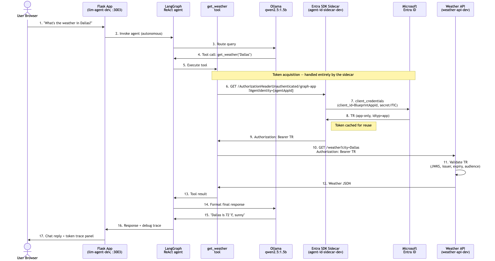
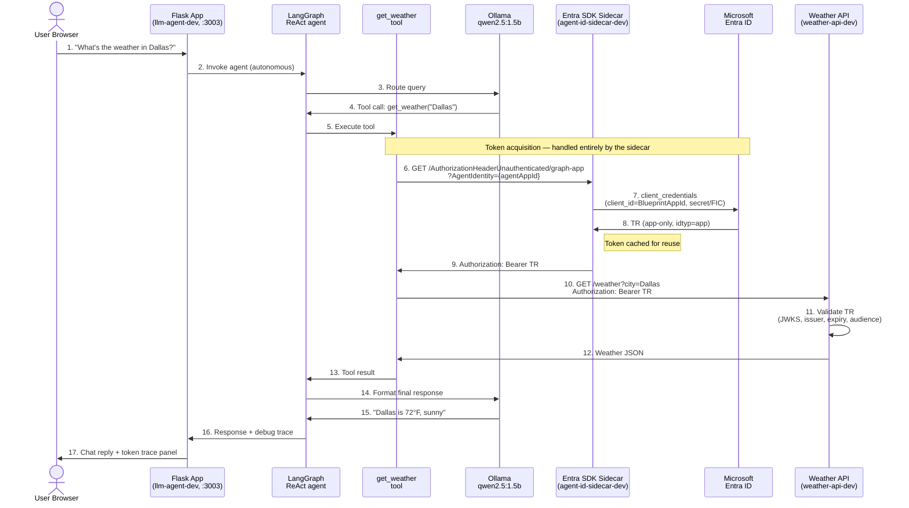
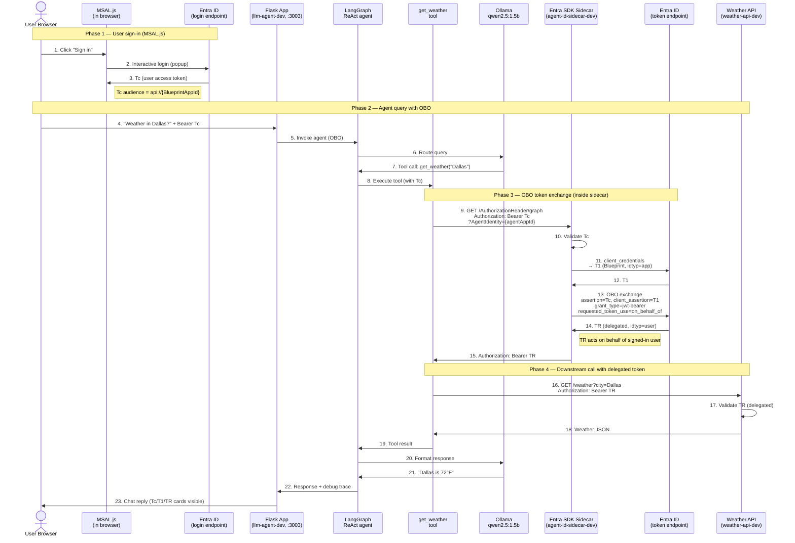

# Local Dev Sidecar (Ollama Edition)

A visual, hands-on demonstration of how AI agents use **Microsoft Entra Agent ID** — via the official **Microsoft Entra SDK auth sidecar** — to securely call downstream APIs. Runs entirely on your laptop with a local LLM via [Ollama](https://ollama.com).

> **TODO:** Screenshots of the UI (chat view, token trace panel, OBO sign-in) need to be captured and added to `docs/images/` before publishing.

> **New to Agent ID?** Start with the [Sidecar Guide](../SIDECAR-GUIDE.md) for the fundamentals. This sample builds on that with a complete end-to-end demo.

---

## 1. Why the Microsoft Entra SDK sidecar?

This sample deliberately uses the **official [Microsoft Entra SDK auth sidecar](https://mcr.microsoft.com/en-us/product/entra-sdk/auth-sidecar/about)** container (`mcr.microsoft.com/entra-sdk/auth-sidecar`) rather than rolling our own token client. Here's why:

- **Interoperable across any cloud or on-prem** — the same container image (`mcr.microsoft.com/entra-sdk/auth-sidecar`) runs identically on Azure, AWS, GCP, Kubernetes, or a laptop. Standard OAuth2 flows (client credentials, OBO, federated credentials) are implemented once by the identity team and consumed the same way everywhere.
- **Your agent code stays decoupled from token exchanges.** The LLM agent never handles `client_id`, `client_secret`, certificates, JWKS, token caching, or OBO exchange. It just asks the sidecar: *"Give me an authorization header for this downstream API."*
- **Swap credentials without touching agent code.** `ClientSecret` for dev, `SignedAssertionFromManagedIdentity` for production on Azure — change one env var, no code changes.
- **Token caching, refresh, and expiry are handled for you.** No MSAL integration to debug.
- **Security boundary is explicit.** The sidecar has no host port. Only services inside the Docker network can request tokens — your agent, not your browser, not random processes on the host.

### What the agent does vs what the sidecar does

| Agent (your code) | Sidecar (Microsoft Entra SDK) |
|---|---|
| Decide *when* to call the API | Acquire and cache the right token |
| Build the HTTP request | Perform client-credentials / OBO exchange |
| Pass through user token for OBO | Validate & forward user assertion |
| Handle business logic | Talk to `login.microsoftonline.com` |

If you're shipping an agent to production, **this separation is the recommended pattern** — your code never sees a secret, and all credential policy lives in one place.

---

## 2. What this sample demonstrates

- **Two execution modes**: Direct tool call (fast, no LLM) vs LangChain + Ollama (agentic tool calling)
- **Two identity flows**: Autonomous agent (app-only) vs On-Behalf-Of (OBO, acting for a signed-in user)
- **Full token lifecycle**: Tc (user token) → T1 (blueprint app token) → TR (agent token) → downstream API
- **JWT validation end-to-end**: The weather API verifies signature (JWKS / RS256), issuer, and expiry on every request
- **LangGraph ReAct agent**: Modern LangChain 1.x pattern with `langchain.agents.create_agent`

---

## 3. Architecture

The sidecar sits between your agent and Microsoft Entra ID. The agent **never** talks to Entra directly, and it **never** sees a credential — it just asks the sidecar for an `Authorization:` header for a named downstream API.

### 3.1 High-level flow (the 30-second view)

```
     ┌──────────┐   ask     ┌──────────┐  get token   ┌──────────┐
     │  Agent   │ ────────▶ │ Sidecar  │ ───────────▶ │  Entra   │
     │ (Flask + │           │ (Entra   │ ◀─────────── │   ID     │
     │  LLM)    │ ◀──────── │   SDK)   │   TR token   └──────────┘
     └────┬─────┘  header   └──────────┘
          │
          │ call API with Bearer TR
          ▼
     ┌──────────┐
     │ Weather  │   validates TR, returns data
     │   API    │
     └──────────┘
```

**Three moving parts, one rule:** the **Agent** focuses on reasoning, the **Sidecar** owns all identity/credential work, the **downstream API** just validates the token it's given. Swap the LLM, swap the API, swap the credential type — the sidecar contract (`GET /AuthorizationHeader…`) stays the same.

### 3.2 Detailed architecture

```
┌───────────────────────────────────────────────────────────────────────────────┐
│                     agent-network-dev (Docker bridge)                         │
│                                                                               │
│                                      ─────────── request path ────────────▶   │
│                                      ◀───────── response path ─────────────   │
│                                                                               │
│  You (browser)                                                                │
│   http://localhost:3003 ────┐                                                 │
│                             │                                                 │
│                             ▼                                                 │
│   ┌──────────────────────────────────┐                                        │
│   │  llm-agent-dev  (Flask + UI)     │                                        │
│   │  :3000 → host :3003              │                                        │
│   │                                  │                                        │
│   │  ① Receive user query            │                                        │
│   │  ② LangGraph ReAct agent runs    │                                        │
│   │  ③ Tool needs to call weather API│                                        │
│   │     → ask sidecar for a token    │                                        │
│   └──────────────┬───────────────────┘                                        │
│                  │ ④ GET /AuthorizationHeader...                              │
│                  │    ?AgentIdentity={agentId}                                │
│                  │    (Bearer Tc if OBO)                                      │
│                  ▼                                                            │
│   ┌──────────────────────────────────┐      ⑤ OAuth2   ┌─────────────────┐   │
│   │  agent-id-sidecar-dev            │ ──────────────▶ │  Microsoft      │   │
│   │  Microsoft Entra SDK             │                 │  Entra ID       │   │
│   │  (official MS container image)   │ ◀────────────── │  login.micro... │   │
│   │  NO host port — network only     │   ⑥ T1 or TR    │                 │   │
│   │                                  │                 └─────────────────┘   │
│   │  Responsibilities:               │                                        │
│   │   • client_credentials flow      │                                        │
│   │   • OBO exchange (Tc+T1 → TR)    │                                        │
│   │   • Token caching & refresh      │                                        │
│   │   • Credential management        │                                        │
│   │     (ClientSecret, ManagedId,    │                                        │
│   │      KeyVault, certificate…)     │                                        │
│   └──────────────┬───────────────────┘                                        │
│                  │ ⑦ Authorization: Bearer TR                                 │
│                  ▼                                                            │
│   ┌──────────────────────────────────┐                                        │
│   │  weather-api-dev                 │                                        │
│   │                                  │                                        │
│   │  ⑧ Validate TR (JWKS, RS256,     │                                        │
│   │    issuer, expiry, audience)     │                                        │
│   │  ⑨ Return weather JSON           │                                        │
│   └──────────────────────────────────┘                                        │
│                                                                               │
│   ┌──────────────────────────────────┐                                        │
│   │   ollama-dev (qwen2.5:1.5b)      │  ← only when Execution Mode = Ollama   │
│   └──────────────────────────────────┘                                        │
└───────────────────────────────────────────────────────────────────────────────┘
```

**The key insight:** step ⑤ and ⑥ are the *only* place a credential is ever handled. It happens inside the sidecar, on a network the agent can't directly reach from outside. Your agent code at step ③ just does `requests.get(sidecar_url)` — no MSAL, no certificates, no secrets in application memory.

### Token flow

| Token | Issued to | When | How |
|---|---|---|---|
| **Tc** | Signed-in user | OBO flow only | MSAL.js in the browser |
| **T1** | Blueprint app | Both flows | Sidecar (client credentials) |
| **TR** | Agent (downstream API) | Both flows | Sidecar — app-only (autonomous) or OBO exchange |

### Modes and flows (2×2 matrix)

|                     | **Autonomous** (app-only) | **OBO** (on behalf of user) |
|---------------------|----------------------------|------------------------------|
| **Direct** (no LLM) | Fast demo path. TR token fetched, weather API called directly. | Same, but uses the authenticated sidecar endpoint with Tc. |
| **Ollama + LangChain** | LangGraph ReAct agent decides when to call the `get_weather` tool. | Same, agent passes Tc through when the tool runs. |

---

## 4. Sequence diagrams

### 4.1 Autonomous flow (app-only)

No user, no sign-in. The agent is authenticated as itself.



<details>
<summary><b>📊 Show sequence diagram source (Mermaid) — Autonomous flow</b></summary>



</details>

### 4.2 OBO flow (on-behalf-of a signed-in user)

The agent acts for a specific user. The sidecar performs a 3-step exchange and the downstream API sees a *delegated* token.


<details>
<summary><b>📊 Show sequence diagram source (Mermaid) — OBO flow</b></summary>



</details>

### 4.3 What the Identity Trace panel shows

```
✅ 0.A START                User query received
✅ 0.B LANGCHAIN           Sending to LangGraph ReAct agent
✅ 1.B TOOL CALL           LLM decides to call get_weather
✅ 2.A TOKEN REQUEST       Request Agent Identity token
✅ 2.B SIDECAR CALL        Sidecar URL with AgentIdentity=…
✅ 2.C TOKEN RECEIVED      TR JWT received (decoded claims shown)
✅ 3.A API CALL            Calling Weather API
✅ 3.B API URL             Weather endpoint + Authorization header
✅ 3.C TOKEN VALIDATION    What the API checks (JWKS, iss, exp, aud)
✅ 3.D API RESPONSE        Weather data received (full JSON)
✅ 4.  TOOL RESULT         Tool execution complete
✅ 5.  COMPLETE            Response sent to user
```

For OBO, you'll additionally see **Tc** (user token from MSAL) and **T1** (blueprint app-only token) cards before the **TR**.

---

## 5. Prerequisites

Works on **macOS**, **Linux**, and **Windows 10/11**.

| Need | macOS | Linux | Windows |
|---|---|---|---|
| Docker | Docker Desktop | Docker Engine + Compose v2 | Docker Desktop (WSL 2 backend recommended) |
| Shell for `.sh` helpers | Terminal (bash/zsh) | bash | **WSL** or **Git Bash** (one of the OBO setup helpers is bash-only) |
| PowerShell 7+ | `brew install --cask powershell` | [install docs](https://learn.microsoft.com/en-us/powershell/scripting/install/installing-powershell-on-linux) | built-in (or install PS 7+) |
| Azure CLI | `brew install azure-cli` | [install docs](https://learn.microsoft.com/en-us/cli/azure/install-azure-cli-linux) | `winget install -e Microsoft.AzureCLI` |
| Python 3.11+ (only if you run tests) | `brew install python@3.11` | distro package | `winget install -e Python.Python.3.11` |

You also need a **registered Agent ID in Microsoft Entra** — the repo-root PowerShell workflow creates all of that (Blueprint app with client secret, Agent ID, and — via the helper scripts — the SPA app used for OBO sign-in). See [§7.2](#72-first-time-setup--create-the-entra-objects).

Ollama is **not** a prerequisite on the host — it runs inside the compose stack and pulls `qwen2.5:1.5b` automatically.

---

## 6. Environment variables

See [.env.example](./.env.example) for the full template.

| Variable | Description |
|---|---|
| `TENANT_ID` | Your Entra tenant ID |
| `BLUEPRINT_APP_ID` | Blueprint app registration — the sidecar authenticates as this app |
| `BLUEPRINT_CLIENT_SECRET` | Blueprint client secret (dev only — see below) |
| `AGENT_CLIENT_ID` | Your Agent ID (appears as `AgentIdentity` query param) |
| `CLIENT_SPA_APP_ID` | SPA app ID used by MSAL.js for browser sign-in (OBO only) |
| `OLLAMA_MODEL` | Default `qwen2.5:1.5b`. Larger models give better tool calling. |

### Blueprint credential — pick the right `SourceType`

The sidecar supports multiple credential types via `AzureAd__ClientCredentials__0__SourceType` in [docker-compose.yml](./docker-compose.yml):

| SourceType | When to use |
|---|---|
| `ClientSecret` | **Local dev only** — what this sample ships with |
| `SignedAssertionFromManagedIdentity` | **Production on Azure** — zero secrets, recommended |
| `KeyVault` | Certificate from Azure Key Vault |
| `StoreWithThumbprint` | Certificate from local machine store |

Reference: [microsoft-identity-web / Client Credentials](https://github.com/AzureAD/microsoft-identity-web/wiki/Client-Credentials)

---

## 7. Run it and open the UI

> **Supported hosts:** macOS, Linux, and Windows 10/11. Every command below is given for **bash** (macOS / Linux / WSL / Git Bash) and **PowerShell 7+** (Windows). Pick the one that matches your shell.

### 7.1 Do you already have an `.env` from a previous run?

If **yes** — you've already run the tenant setup once and have `sidecar/dev/.env` populated with `TENANT_ID`, `BLUEPRINT_APP_ID`, `BLUEPRINT_CLIENT_SECRET`, `AGENT_CLIENT_ID`, and (for OBO) `CLIENT_SPA_APP_ID` — **skip to [7.3 Start the stack](#73-start-the-stack)**.

> **Why?** All the Entra objects (Blueprint app, client secret, Agent ID, SPA app registration, OBO scope consent) are tenant-side state. They survive `docker compose down`, reboots, and git resets. You only need to set them up once per tenant.

Not sure? Run the matching snippet:

**bash (macOS / Linux / WSL / Git Bash)**

```bash
cd sidecar/dev
test -f .env && grep -q '^BLUEPRINT_APP_ID=.\+' .env && echo "✅ .env looks ready" || echo "❌ run 7.2 first"
```

**PowerShell (Windows)**

```powershell
Cd sidecar/dev
if ((Test-Path .env) -and (Select-String '^BLUEPRINT_APP_ID=.+' .env -Quiet)) { "✅ .env looks ready" } else { "❌ run 7.2 first" }
```

### 7.2 First-time setup — create the Entra objects

Run this **once per tenant**. It creates the Blueprint app, Agent ID, and the SPA app used for OBO sign-in.

**a. Create Blueprint + Agent ID** (autonomous flow only)

Follow the PowerShell workflow in the **[repo root README](../../README.md)** (works on macOS, Linux and Windows with [PowerShell 7+](https://learn.microsoft.com/en-us/powershell/scripting/install/installing-powershell)). At the end you'll have:

- `TENANT_ID` — your Entra tenant
- `BLUEPRINT_APP_ID` — Blueprint app registration
- `BLUEPRINT_CLIENT_SECRET` — client secret for the Blueprint
- `AGENT_CLIENT_ID` — the Agent ID created from the Blueprint

**b. Create the SPA app + wire up OBO** (required for OBO flow)

Two helper scripts are provided. The SPA-app creation script is bash-only; on Windows run it from **WSL** or **Git Bash**.

**bash (macOS / Linux / WSL / Git Bash)**

```bash
# Create the SPA app registration for MSAL.js browser sign-in
bash ../../scripts/setup-obo-client-app.sh
# → prints CLIENT_SPA_APP_ID

# Wire up the OBO scope + admin consent on the Blueprint
bash ../../scripts/setup-obo-blueprint.sh
```

**PowerShell (Windows — native)**

```powershell
# Step 1 — run the SPA-app creation from Git Bash or WSL (no .ps1 equivalent):
#   bash ../../scripts/setup-obo-client-app.sh
#
# Step 2 — back in PowerShell, wire up OBO on the Blueprint:
pwsh ../../scripts/setup-obo-blueprint.ps1 `
    -TenantId        '<TENANT_ID>' `
    -BlueprintAppId  '<BLUEPRINT_APP_ID>' `
    -AgentAppId      '<AGENT_CLIENT_ID>' `
    -ClientSpaAppId  '<CLIENT_SPA_APP_ID>'
```

**c. Populate `.env`**

**bash**

```bash
cp .env.example .env
"${EDITOR:-vi}" .env   # paste in the 5 values from steps a and b
```

**PowerShell**

```powershell
Copy-Item .env.example .env
notepad .env   # or: code .env
```

Minimum required for **autonomous flow**: `TENANT_ID`, `BLUEPRINT_APP_ID`, `BLUEPRINT_CLIENT_SECRET`, `AGENT_CLIENT_ID`.
Additionally required for **OBO flow**: `CLIENT_SPA_APP_ID`.

See section [6. Environment variables](#6-environment-variables) for details on each.

### 7.3 Start the stack

`docker compose` is identical on all hosts — make sure **Docker Desktop** (macOS / Windows) or the **Docker Engine** (Linux) is running first.

```bash
cd sidecar/dev
docker compose up --build -d
```

First run takes ~30 seconds while Ollama pulls `qwen2.5:1.5b`. Check readiness:

**bash**

```bash
curl http://localhost:3003/api/status
# {"ollama_available": true, "ollama_model": "qwen2.5:1.5b", ...}
```

**PowerShell**

```powershell
Invoke-RestMethod http://localhost:3003/api/status
# ollama_available : True
# ollama_model     : qwen2.5:1.5b
```

### 7.4 Open the UI

**→ [http://localhost:3003](http://localhost:3003)** ← the only port exposed to your host.

A two-panel layout:

- **Left panel — Chat**
  - Header bar shows your **Tenant ID** and **Agent ID**
  - Two toggles control the demo:
    - **Execution Mode**: `Direct` (skip LLM) or `Ollama` (LangChain ReAct agent)
    - **Identity Flow**: `Autonomous` (app-only token) or `OBO` (acts for signed-in user)
  - Input is pre-populated with *"Weather in Dallas?"* — press Send
  - When **Identity Flow = OBO**, a **Sign in** button appears (MSAL.js popup)

- **Right panel — Identity Trace**
  - Step-by-step debug trace of every token exchange and API call
  - Color-coded JWT cards for each token (**Tc** / **T1** / **TR**) with decoded claims
  - Shows exactly what the weather API validates on each request

**Ports exposed:**

| Port | Service | Access |
|---|---|---|
| **3003** | Chat UI | `http://localhost:3003` — you |
| *none* | Sidecar, weather API, Ollama | Docker network only (trust boundary) |

---

## 8. Services

| Service | Container | Host port | Role |
|---|---|---|---|
| `llm-agent` | `llm-agent-dev` | **3003** | Flask app + chat UI + LangChain agent |
| `sidecar` | `agent-id-sidecar-dev` | *none* | Microsoft Entra SDK — issues tokens |
| `weather-api` | `weather-api-dev` | *none* | Downstream API, validates JWT on every request |
| `ollama` | `ollama-dev` | *none* | Local LLM — only used in Ollama mode |

> **Security note:** Only the UI is exposed to the host. The sidecar, weather-api and Ollama are reachable only within the Docker network, per [Microsoft's trust-boundary guidance](https://learn.microsoft.com/en-us/entra/msidweb/agent-id-sdk/security).

---

## 9. Running the tests

Unit tests cover JWT decode, debug logging, all Flask routes, input validation, city extraction, and LangChain agent creation.

**bash (macOS / Linux / WSL / Git Bash)**

```bash
cd sidecar/dev
python3 -m venv .venv && source .venv/bin/activate
pip install -r requirements.txt pytest
python3 -m pytest tests/ -v
```

**PowerShell (Windows)**

```powershell
Cd sidecar/dev
python -m venv .venv
. .\.venv\Scripts\Activate.ps1
pip install -r requirements.txt pytest
python -m pytest tests/ -v
```

Expected: **28 passed in ~4s, zero warnings**.

---

## 10. LangChain version and architecture

| Package | Pinned | Role |
|---|---|---|
| `langchain` | `>=1.0.0` | Hosts `create_agent` (LangGraph ReAct builder) |
| `langchain-core` | `>=1.0.0` | `@tool` decorator, message types |
| `langchain-ollama` | `>=1.0.0` | `ChatOllama` provider |
| `langgraph` | `>=1.0.0` | Underlying agent runtime |

The agent is a **LangGraph ReAct agent** built with [`langchain.agents.create_agent`](https://docs.langchain.com/oss/python/langchain/agents) — this is the current pattern as of LangChain 1.x. The older `AgentExecutor` / `langgraph.prebuilt.create_react_agent` paths are deprecated and no longer used.

---

## 11. Troubleshooting

| Symptom | Likely cause | Fix |
|---|---|---|
| `/api/status` → `ollama_available: false` | Model still downloading | Wait ~30s, check `docker logs ollama-dev` |
| Weather API returns `401 Unauthorized` | Token tenant mismatch, expired secret, or signature check failed | Verify `TENANT_ID` matches the blueprint's tenant; check sidecar logs |
| LLM returns weather without calling the tool | `qwen2.5:1.5b` is too small for reliable tool calling | Switch `OLLAMA_MODEL` to `qwen2.5:7b` or `llama3.1:8b` |
| OBO sign-in popup blocked | Browser popup blocker | Allow popups for `localhost:3003` |
| `4xx` from sidecar during OBO | `CLIENT_SPA_APP_ID` missing or SPA redirect URI mismatch | Re-run the PowerShell workflow; ensure `http://localhost:3003` is on the SPA's redirect URIs |

Container logs:

```bash
docker logs llm-agent-dev
docker logs agent-id-sidecar-dev
docker logs weather-api-dev
```

---

## 12. Stop & cleanup

```bash
# Stop containers, keep volumes/images
docker compose down

# Also remove the Ollama model cache
docker compose down -v

# Nuke everything (containers, volumes, images)
docker compose down -v --rmi all
```

---

## 13. Files

```
sidecar/dev/
├── app.py               # Flask app + LangGraph ReAct agent + sidecar client
├── docker-compose.yml   # llm-agent, sidecar, weather-api, ollama
├── Dockerfile           # Python 3.11 slim base
├── requirements.txt     # LangChain 1.x, Flask, MSAL
├── .env.example         # Template — copy to .env
├── templates/
│   └── index.html       # Chat UI, MSAL.js, token trace panel
└── tests/
    ├── __init__.py
    └── test_app.py      # 28 pytest tests
```

---

## 14. References

- [Microsoft Entra Agent ID](https://learn.microsoft.com/en-us/entra/identity-platform/agent-identity/)
- [Microsoft Entra SDK auth sidecar (container image)](https://mcr.microsoft.com/en-us/product/entra-sdk/auth-sidecar/about)
- [LangChain Agents (v1)](https://docs.langchain.com/oss/python/langchain/agents)
- [microsoft-identity-web Client Credentials](https://github.com/AzureAD/microsoft-identity-web/wiki/Client-Credentials)
