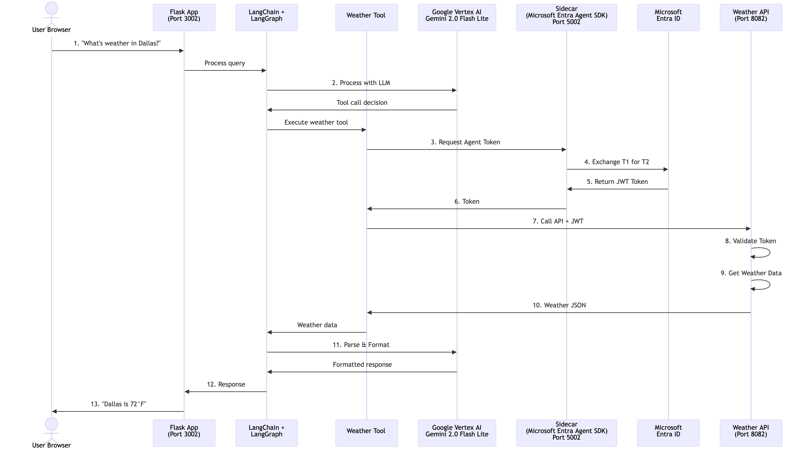
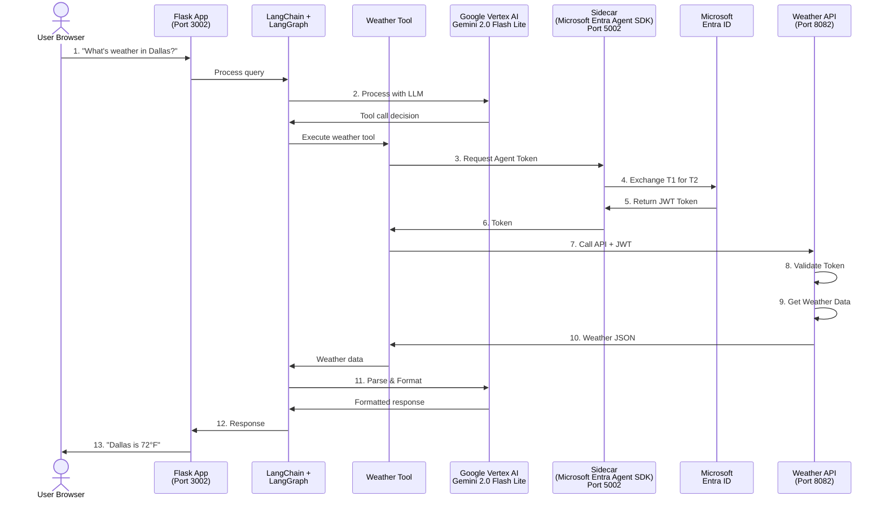

# 3P Agent Identity Demo - Google Vertex AI Edition

A demonstration of how AI agents use **Microsoft Entra Agent Identity** tokens to securely call APIs, powered by **Google Vertex AI** instead of AWS Bedrock or Ollama.

## What's Different from the AWS Version?

- **Google Vertex AI LLM** instead of AWS Bedrock
- Uses **Gemini 1.5 Pro** (or any Vertex AI model)
- Requires Google Cloud credentials
- Runs on port **3002** (instead of 3001 for AWS or 3000 for Ollama)
- Separate docker-compose configuration for independent deployment

## Sequence Diagram (Detailed Flow)



<details>
<summary>View Mermaid source code</summary>



</details>

### 5000-Feet View

```
                  ┌──────────────────┐
                  │   1. USER QUERY  │
                  │  "Weather in NY?"│
                  └────────┬─────────┘
                           │
                           ▼
              ┌────────────────────────────┐
              │ 2. LLM AGENT (Vertex AI)   │
              │  Gemini 2.0 Flash Lite     │
              └────────────┬───────────────┘
                           │
                           ▼
                ┌─────────────────────┐            ┌─────────────────────┐
                │  3. ENTRA SDK       │───────────▶│ Microsoft Entra ID  │
                │  for Agent ID       │  Request   │ (External Service)  │
                │  (T1 → T2)          │◀───────────│ Token Exchange      │
                └──────────┬──────────┘  Token Back└─────────────────────┘
                           │
                           ▼
                ┌─────────────────────┐
                │  4. WEATHER API     │
                │  • Validate Token   │
                │  • Get Weather Data │
                │  • JSON Results     │
                └──────────┬──────────┘
                           │ JSON back to LLM Agent
                           ▼
              ┌────────────────────────────┐
              │ 5. LLM PARSES & RESPONDS   │
              │  Gemini formats answer     │
              │  Sends response to user    │
              └────────────────────────────┘
```

**Flow Steps:**
1. User asks weather question
2. Gemini (Google Vertex AI) processes query and calls weather tool
3. Tool gets Agent Identity token from Sidecar → Entra ID
4. Tool calls Weather API with token → validates → gets weather → returns JSON
5. JSON flows back to Gemini → parses and formats answer → user sees result

## Prerequisites

1. **Microsoft Entra Agent Identity Setup**
   - Complete the [Main README](../../README.md) setup
   - Have your Blueprint and Agent Identity created
   - Have `.env` file configured with Agent ID credentials

2. **Google Cloud Account and Credentials**
   - Google Cloud project with Vertex AI API enabled
   - Service account with Vertex AI User role
   - Service account key JSON file

## Quick Start

### 1. Enable Vertex AI API

```bash
# Set your project ID
export GCP_PROJECT_ID="your-project-id"

# Enable Vertex AI API
gcloud services enable aiplatform.googleapis.com --project=$GCP_PROJECT_ID
```

### 2. Create Service Account and Key

```bash
# Create service account
gcloud iam service-accounts create vertex-ai-agent \
    --display-name="Vertex AI Agent" \
    --project=$GCP_PROJECT_ID

# Grant Vertex AI User role
gcloud projects add-iam-policy-binding $GCP_PROJECT_ID \
    --member="serviceAccount:vertex-ai-agent@${GCP_PROJECT_ID}.iam.gserviceaccount.com" \
    --role="roles/aiplatform.user"

# Create and download key
gcloud iam service-accounts keys create vertex-ai-key.json \
    --iam-account=vertex-ai-agent@${GCP_PROJECT_ID}.iam.gserviceaccount.com

# Move key to sidecar directory
mv vertex-ai-key.json <path-to-repo>/sidecar/
```

### 3. Configure Credentials

Add to your `.env` file in the `sidecar` directory:

```env
# Existing Agent Identity credentials
TENANT_ID=your-tenant-id
BLUEPRINT_APP_ID=your-blueprint-app-id
BLUEPRINT_CLIENT_SECRET=your-secret
AGENT_CLIENT_ID=your-agent-app-id

# New Google Vertex AI credentials
GCP_PROJECT_ID=your-gcp-project-id
GCP_LOCATION=us-central1
VERTEXAI_MODEL_ID=gemini-1.5-pro
GOOGLE_APPLICATION_CREDENTIALS=/app/vertex-ai-key.json
```

**Important:** The `GOOGLE_APPLICATION_CREDENTIALS` path should be `/app/vertex-ai-key.json` (the path inside the Docker container).

### 4. Start the Google Vertex AI Demo

From the `sidecar` directory:

```bash
# Start all services with Google Vertex AI
docker-compose -f docker-compose-google.yml up -d

# Check status
docker-compose -f docker-compose-google.yml ps

# View logs
docker-compose -f docker-compose-google.yml logs -f llm-agent-google
```

### 5. Open the Demo

Navigate to: **http://localhost:3002**

## Demo UI


The UI provides:
- **Query input** - Ask natural language questions about weather
- **Debug panel** - Real-time flow visualization showing each step
- **Mode toggle** - Switch between Direct and Vertex AI agent modes
- **Token details** - View decoded JWT claims and validation

## Two Modes

| Mode | Description |
|------|-------------|
| **⚡ Direct Mode** | Skips LLM, calls weather tool directly. Fast demo of Agent Identity token flow. |
| **🤖 Vertex AI Mode** | Google Vertex AI (Gemini) decides when to call tools. Demonstrates agentic behavior. |

### Request Flow (What You See in UI)

```
✅ 0. START                User query received
✅ 0. VERTEX AI            Sending to Google Vertex AI
✅ 0. AGENT READY          LangChain agent created
✅ 1. TOOL CALLED          LLM decides to call weather tool
✅ 2.A TOKEN REQUEST       Request Agent Identity token
✅ 2.B REQUEST URL         Sidecar URL with Agent ID
✅ 2.C TOKEN RECEIVED      Got JWT with claims (shows decoded token)
✅ 3.A API CALL            Calling Weather API
✅ 3.B API URL             Weather API endpoint
✅ 3.C API RESPONSE        Weather data received (shows full JSON)
✅ 4. TOOL RESULT          Tool execution complete
✅ 5. COMPLETE             Response sent to user
```

## Available Vertex AI Models

You can use any Vertex AI model by setting `VERTEXAI_MODEL_ID`:

```env
# Gemini 1.5 Pro (recommended)
VERTEXAI_MODEL_ID=gemini-1.5-pro

# Gemini 1.5 Flash (faster, cheaper)
VERTEXAI_MODEL_ID=gemini-1.5-flash

# Gemini 1.0 Pro
VERTEXAI_MODEL_ID=gemini-1.0-pro
```

## Supported Regions

Common Vertex AI regions:
- `us-central1` (Iowa) - Default
- `us-east4` (Virginia)
- `us-west1` (Oregon)
- `europe-west1` (Belgium)
- `asia-northeast1` (Tokyo)

## How It Works

### Direct Mode (Default)
1. User asks about weather
2. Tool gets Agent Identity token from sidecar
3. Tool calls Weather API with token
4. API validates token and returns data
5. Response displayed to user

### Vertex AI Mode (LLM-Powered)
1. User asks about weather
2. Query sent to Google Vertex AI (Gemini)
3. LLM decides to use `get_weather` tool
4. Tool gets Agent Identity token from sidecar
5. Tool calls Weather API with token
6. API validates token and returns data
7. LLM formats and returns natural language response


**Key Components:**
- **Google Vertex AI**: Provides Gemini models for natural language understanding and tool calling
- **LangChain + LangGraph**: Orchestrates the agent workflow and tool execution
- **Entra SDK Sidecar**: Handles Microsoft Entra Agent Identity token exchange
- **Weather Tool**: Demonstrates secure API calling with agent identity
- **Weather API**: Protected resource that validates agent tokens

## Management Commands

```bash
# Start services
docker-compose -f docker-compose-google.yml up -d

# Stop services
docker-compose -f docker-compose-google.yml down

# View logs
docker-compose -f docker-compose-google.yml logs -f

# View specific service logs
docker-compose -f docker-compose-google.yml logs -f llm-agent-google

# Rebuild after code changes
docker-compose -f docker-compose-google.yml up -d --build llm-agent-google

# Full cleanup
docker-compose -f docker-compose-google.yml down -v --rmi all
```

## Running Multiple Demos Simultaneously

You can run Ollama, AWS Bedrock, and Google Vertex AI demos at the same time:

```bash
# Terminal 1: Start Ollama version (port 3000)
docker-compose up -d

# Terminal 2: Start AWS Bedrock version (port 3001)
docker-compose -f docker-compose-aws.yml up -d

# Terminal 3: Start Google Vertex AI version (port 3002)
docker-compose -f docker-compose-google.yml up -d

# Access:
# - Ollama version: http://localhost:3000
# - AWS Bedrock version: http://localhost:3001
# - Google Vertex AI version: http://localhost:3002
```

## Troubleshooting

### "Vertex AI not available" Error

1. **Check API is enabled:**
   ```bash
   gcloud services list --enabled --project=$GCP_PROJECT_ID | grep aiplatform
   ```

2. **Verify service account permissions:**
   ```bash
   gcloud projects get-iam-policy $GCP_PROJECT_ID \
       --flatten="bindings[].members" \
       --filter="bindings.members:serviceAccount:vertex-ai-agent@*"
   ```

3. **Test credentials:**
   ```bash
   gcloud auth activate-service-account --key-file=vertex-ai-key.json
   gcloud auth list
   ```

### "Model not found" Error

Check available models in your region:
```bash
gcloud ai models list --region=$GCP_LOCATION --project=$GCP_PROJECT_ID
```

### Port Already in Use

If port 3002 is in use, modify `docker-compose-google.yml`:
```yaml
ports:
  - "3003:3000"  # Use different external port
```

## Viewing Logs in Google Cloud

### Enable Cloud Logging for Vertex AI

First, ensure Cloud Logging is enabled:

```bash
# Enable Cloud Logging API
gcloud services enable logging.googleapis.com --project=$GCP_PROJECT_ID

# Grant logging permissions to service account (if needed)
gcloud projects add-iam-policy-binding $GCP_PROJECT_ID \
    --member="serviceAccount:vertex-ai-agent@${GCP_PROJECT_ID}.iam.gserviceaccount.com" \
    --role="roles/logging.viewer"
```

### View Vertex AI Request Logs via Console

1. Open [Google Cloud Console](https://console.cloud.google.com)
2. Navigate to **Vertex AI** → **Dashboard**
3. Click on **Logs** in the left sidebar
4. Or go directly to **Logging** → **Logs Explorer**

Filter for Vertex AI requests:
```
resource.type="aiplatform.googleapis.com/Endpoint"
resource.labels.project_id="YOUR_PROJECT_ID"
```

### View Logs via gcloud Command

**View recent Vertex AI API calls:**
```bash
gcloud logging read "resource.type=aiplatform.googleapis.com/Endpoint" \
    --limit=50 \
    --format=json \
    --project=$GCP_PROJECT_ID
```

**View logs with token information:**
```bash
gcloud logging read "resource.type=aiplatform.googleapis.com/Endpoint \
    AND jsonPayload.request_json=~'.*'" \
    --limit=10 \
    --format="table(timestamp, jsonPayload.model_id, jsonPayload.response_json)" \
    --project=$GCP_PROJECT_ID
```

**Filter logs by model:**
```bash
gcloud logging read "resource.type=aiplatform.googleapis.com/Endpoint \
    AND jsonPayload.model_id=\"gemini-2.0-flash-lite\"" \
    --limit=20 \
    --format=json \
    --project=$GCP_PROJECT_ID
```

**View logs from the last hour:**
```bash
gcloud logging read "resource.type=aiplatform.googleapis.com/Endpoint \
    AND timestamp>\"$(date -u -v-1H '+%Y-%m-%dT%H:%M:%SZ' 2>/dev/null || date -u -d '1 hour ago' '+%Y-%m-%dT%H:%M:%SZ')\"" \
    --limit=50 \
    --project=$GCP_PROJECT_ID
```

### Monitor Token Usage

**View token consumption metrics:**
```bash
# Get prediction count
gcloud logging read "resource.type=aiplatform.googleapis.com/Endpoint \
    AND jsonPayload.model_id:*" \
    --limit=100 \
    --format="value(jsonPayload.input_token_count, jsonPayload.output_token_count)" \
    --project=$GCP_PROJECT_ID
```

**Check total requests in the last 24 hours:**
```bash
gcloud logging read "resource.type=aiplatform.googleapis.com/Endpoint \
    AND timestamp>\"$(date -u -v-24H '+%Y-%m-%dT%H:%M:%SZ' 2>/dev/null || date -u -d '24 hours ago' '+%Y-%m-%dT%H:%M:%SZ')\"" \
    --limit=1000 \
    --format="table(timestamp)" \
    --project=$GCP_PROJECT_ID | wc -l
```

### View Real-Time Logs

**Tail logs in real-time:**
```bash
gcloud logging tail "resource.type=aiplatform.googleapis.com/Endpoint" \
    --project=$GCP_PROJECT_ID
```

### Analyze Logs with Log Analytics

For detailed analysis, use Log Analytics in Cloud Console:

1. Go to **Logging** → **Log Analytics**
2. Use SQL-like queries:

```sql
SELECT
  timestamp,
  jsonPayload.model_id,
  jsonPayload.input_token_count,
  jsonPayload.output_token_count,
  jsonPayload.total_billable_time
FROM
  `YOUR_PROJECT_ID.global._Default._AllLogs`
WHERE
  resource.type = "aiplatform.googleapis.com/Endpoint"
  AND timestamp >= TIMESTAMP_SUB(CURRENT_TIMESTAMP(), INTERVAL 1 DAY)
ORDER BY timestamp DESC
LIMIT 100
```

### Export Logs to BigQuery

For long-term analysis and cost tracking:

```bash
# Create BigQuery dataset
bq --project_id=$GCP_PROJECT_ID mk vertex_ai_logs

# Create log sink
gcloud logging sinks create vertex-ai-sink \
    bigquery.googleapis.com/projects/$GCP_PROJECT_ID/datasets/vertex_ai_logs \
    --log-filter='resource.type="aiplatform.googleapis.com/Endpoint"' \
    --project=$GCP_PROJECT_ID
```

### View Application Logs

**Check your Flask app logs:**
```bash
# Local Docker logs
docker logs llm-agent-google --tail=100 -f

# Or via docker-compose
docker-compose -f docker-compose-google.yml logs -f llm-agent-google
```

## Cost Considerations

- **Gemini 1.5 Flash** - Most cost-effective for demos
- **Gemini 1.5 Pro** - Better quality, higher cost
- **Gemini 2.0 Flash Lite** - Latest, optimized for speed and cost
- Check current pricing: https://cloud.google.com/vertex-ai/pricing
- Monitor usage via Cloud Logging to track token consumption

## Security Notes

- Never commit `vertex-ai-key.json` to version control
- Add to `.gitignore`: `vertex-ai-key.json`
- Rotate service account keys regularly
- Use workload identity in production environments

## Comparison to Other Versions

| Feature | Ollama | AWS Bedrock | Google Vertex AI |
|---------|--------|-------------|------------------|
| **Cost** | Free (local) | Pay per token | Pay per token |
| **Setup** | Easy | Medium | Medium |
| **Model Quality** | Good | Excellent | Excellent |
| **Latency** | Low | Medium | Medium |
| **Scalability** | Limited | High | High |
| **Port** | 3000 | 3001 | 3002 |
| **Cloud Provider** | None | AWS | Google Cloud |
| **Latest Model** | Llama 3.3 | Claude 3.5 Sonnet | Gemini 2.0 Flash |
| **Tool Calling** | ✅ Yes | ✅ Yes | ✅ Yes |

**Which to choose?**
- **Ollama**: Local development, no cloud costs, good for testing
- **AWS Bedrock**: Enterprise AWS environments, Claude models
- **Google Vertex AI**: Enterprise Google Cloud environments, Gemini models

## Next Steps

- Try different Gemini models
- Experiment with temperature and token settings
- Add more tools to the agent
- Integrate with your own APIs

## Resources

- [Vertex AI Documentation](https://cloud.google.com/vertex-ai/docs)
- [Gemini Models](https://cloud.google.com/vertex-ai/docs/generative-ai/model-reference/gemini)
- [LangChain Google Vertex AI](https://python.langchain.com/docs/integrations/chat/google_vertex_ai_palm)
- [Agent Identity Documentation](../../README.md)
