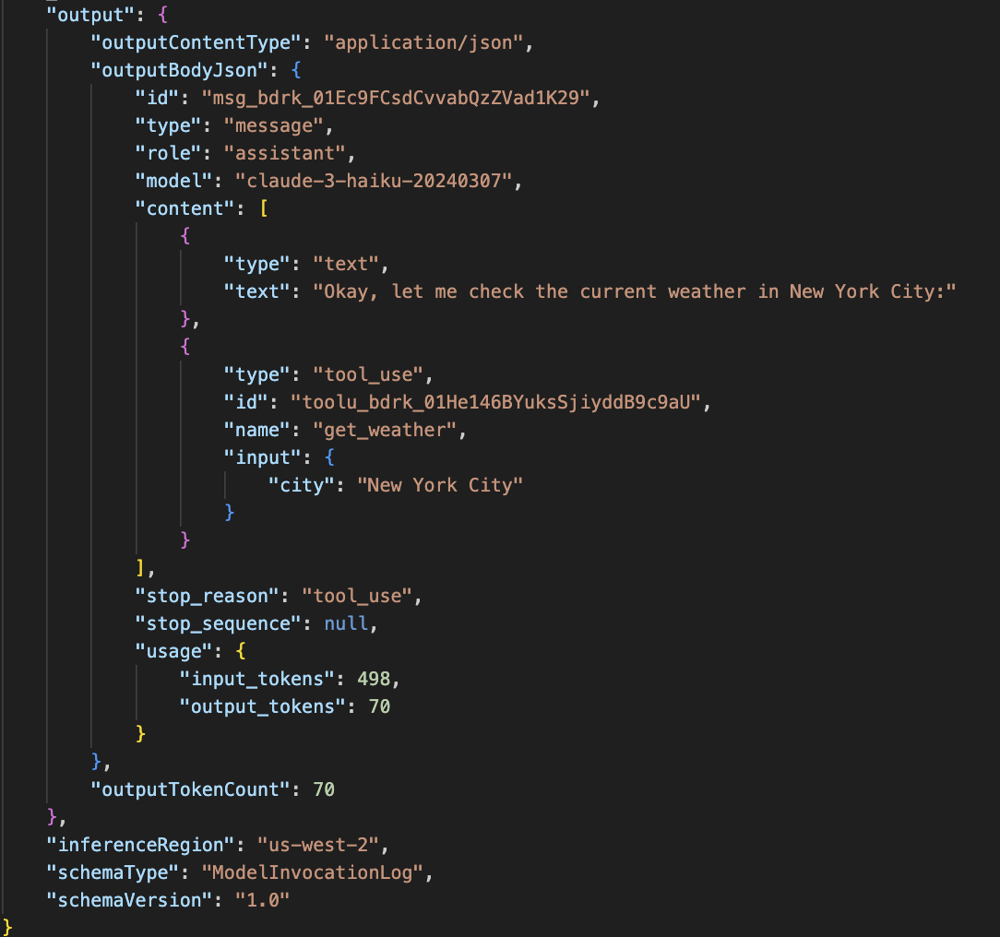
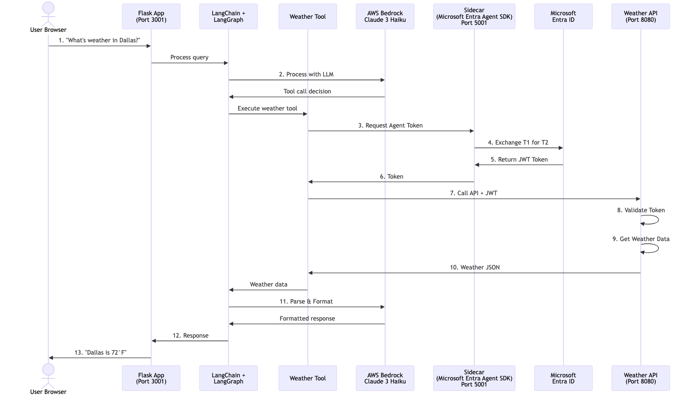
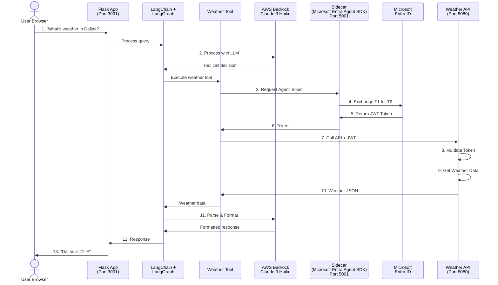

# 3P Agent Identity Demo - AWS Bedrock Edition

A demonstration of how AI agents use **Microsoft Entra Agent Identity** tokens to securely call APIs, powered by **AWS Bedrock** instead of Ollama.

## What's Different from the Ollama Version?

- **AWS Bedrock LLM** instead of local Ollama
- Uses **Claude 3 Sonnet** (or any Bedrock model)
- Requires AWS credentials
- Runs on port **3001** (instead of 3000)
- Separate docker-compose file for independent deployment

## Prerequisites

1. **Microsoft Entra Agent Identity Setup**
   - Complete the [Main README](../../README.md) setup
   - Have your Blueprint and Agent Identity created
   - Have `.env` file configured with Agent ID credentials

2. **AWS Account and Credentials**
   - AWS account with Bedrock access
   - AWS Access Key ID and Secret Access Key
   - Bedrock model access enabled in your region

## Quick Start

### 1. Configure AWS Credentials

Add to your `.env` file in the `sidecar` directory:

```env
# Existing Agent Identity credentials
TENANT_ID=your-tenant-id
BLUEPRINT_APP_ID=your-blueprint-app-id
BLUEPRINT_CLIENT_SECRET=your-secret
AGENT_CLIENT_ID=your-agent-app-id

# New AWS Bedrock credentials
AWS_REGION=us-east-1
AWS_ACCESS_KEY_ID=your-aws-access-key
AWS_SECRET_ACCESS_KEY=your-aws-secret-key
BEDROCK_MODEL_ID=anthropic.claude-3-sonnet-20240229-v1:0
```

**Note:** Bedrock models are now automatically enabled when first invoked. No manual activation needed! For Anthropic models, first-time users may be prompted to submit brief use case details.

### 2. Start the AWS Bedrock Demo

From the `sidecar` directory:

```bash
# Start all services with AWS Bedrock
docker-compose -f docker-compose-aws.yml up -d

# Check status
docker-compose -f docker-compose-aws.yml ps

# View logs
docker-compose -f docker-compose-aws.yml logs -f llm-agent-aws
```

### 3. Open the Demo

Navigate to: **http://localhost:3001**

## Demo UI


The UI provides:
- **Query input** - Ask natural language questions about weather
- **Debug panel** - Real-time flow visualization showing each step
- **Mode toggle** - Switch between Direct and Bedrock agent modes
- **Token details** - View decoded JWT claims and validation

## AWS Bedrock Agent Logs

### Input to Bedrock


Shows the request sent to AWS Bedrock with user query and available tools.

### Output from Bedrock


Shows Bedrock's response with tool invocation decision and parameters.

## Available Bedrock Models

You can use any Bedrock model by setting `BEDROCK_MODEL_ID`:

```env
# Claude 3 Sonnet (recommended)
BEDROCK_MODEL_ID=anthropic.claude-3-sonnet-20240229-v1:0

# Claude 3 Haiku (faster, cheaper)
BEDROCK_MODEL_ID=anthropic.claude-3-haiku-20240307-v1:0

# Claude 3 Opus (most capable)
BEDROCK_MODEL_ID=anthropic.claude-3-opus-20240229-v1:0

# Claude 3.5 Sonnet (latest)
BEDROCK_MODEL_ID=anthropic.claude-3-5-sonnet-20241022-v2:0
```

## Two Modes

| Mode | Description |
|------|-------------|
| **⚡ Direct Mode** | Skips LLM, calls weather tool directly. Fast demo of Agent Identity token flow. |
| **☁️ Bedrock Mode** | AWS Bedrock LLM decides when to call tools. Demonstrates agentic behavior. |

## Sequence Diagram (Detailed Flow)



<details>
<summary>View Mermaid source code</summary>



</details>

### 5000-Feet View

```
                  ┌──────────────────┐
                  │   1. USER QUERY  │
                  │  "Weather in NY?"│
                  └────────┬─────────┘
                           │
                           ▼
              ┌────────────────────────────┐
              │   2. LLM AGENT (Bedrock)   │
              │      Claude 3 Haiku        │
              └────────────┬───────────────┘
                           │
                           ▼
                ┌─────────────────────┐            ┌─────────────────────┐
                │  3. Side Car SDK    │───────────▶│ Microsoft Entra ID  │
                │  for Agent ID       │  Request   │ (External Service)  │
                │  (T1 → T2)          │◀───────────│ Token Exchange      │
                └──────────┬──────────┘  Token Back└─────────────────────┘
                           │
                           ▼
                ┌─────────────────────┐
                │  4. WEATHER API     │
                │  • Validate Token   │
                │  • Get Weather Data │
                │  • JSON Results     │
                └──────────┬──────────┘
                           │ JSON back to LLM Agent
                           ▼
              ┌────────────────────────────┐
              │ 5. LLM PARSES & RESPONDS   │
              │  Claude formats answer     │
              │  Sends response to user    │
              └────────────────────────────┘
```

**Flow Steps:**
1. User asks weather question
2. Claude (AWS Bedrock) processes query and calls weather tool
3. Tool gets Agent Identity token from Sidecar → Entra ID
4. Tool calls Weather API with token → validates → gets weather → returns JSON
5. JSON flows back to Claude → parses and formats answer → user sees result
``

### Debug Panel Flow (What You See in UI)

```
✅ 0. START                User query received
✅ 0. BEDROCK             Sending to AWS Bedrock
✅ 0. AGENT READY         LangChain agent created
✅ 1. TOOL CALLED         LLM decides to call weather tool
✅ 2.A TOKEN REQUEST      Request Agent Identity token
✅ 2.B REQUEST URL        Sidecar URL with Agent ID
✅ 2.C TOKEN RECEIVED     Got JWT with claims (shows decoded token)
✅ 3.A API CALL           Calling Weather API
✅ 3.B API URL            Weather API endpoint
✅ 3.C API RESPONSE       Weather data received (shows full JSON)
✅ 4. TOOL RESULT         Tool execution complete
✅ 5. COMPLETE            Response sent to user
```

## Management Commands

```bash
# Start services
docker-compose -f docker-compose-aws.yml up -d

# Stop services
docker-compose -f docker-compose-aws.yml down

# View logs
docker-compose -f docker-compose-aws.yml logs -f

# Rebuild after code changes
docker-compose -f docker-compose-aws.yml up -d --build llm-agent-aws

# Full cleanup
docker-compose -f docker-compose-aws.yml down -v --rmi all
```

## Running Both Demos Simultaneously

You can run both Ollama and AWS Bedrock demos at the same time:

```bash
# Terminal 1: Start Ollama version (port 3000)
docker-compose up -d

# Terminal 2: Start AWS Bedrock version (port 3001)
docker-compose -f docker-compose-aws.yml up -d

# Access:
# - Ollama version: http://localhost:3000
# - Bedrock version: http://localhost:3001
```

## Troubleshooting

### AWS Credentials Not Working

```bash
# Verify credentials in container
docker exec -it llm-agent-aws env | grep AWS

# Check Bedrock access
docker-compose -f docker-compose-aws.yml logs llm-agent-aws
```

### Bedrock Model Not Available

Make sure you've enabled model access in AWS Console:
1. Go to AWS Bedrock console
2. Navigate to "Model access"
3. Request access to Claude models
4. Wait for approval (usually instant)

### Port Conflict

If port 3001 is in use, edit [docker-compose-aws.yml](../docker-compose-aws.yml):

```yaml
llm-agent-aws:
  ports:
    - "3002:3000"  # Change external port
```

## S3 Model Invocation Logging (Cheapest AWS Option)

Enable S3 logging to track all Bedrock model invocations at minimal cost:

### 1. Create S3 Bucket (One-time setup)

```bash
# Create bucket for logs
aws s3 mb s3://my-bedrock-logs-bucket --region us-east-2

# Enable versioning (optional)
aws s3api put-bucket-versioning \
  --bucket my-bedrock-logs-bucket \
  --versioning-configuration Status=Enabled \
  --region us-east-2
```

### 2. Enable Model Invocation Logging

```bash
# Enable logging via AWS CLI
aws bedrock put-model-invocation-logging-configuration \
  --region us-east-2 \
  --logging-config '{
    "s3Config": {
      "bucketName": "my-bedrock-logs-bucket",
      "keyPrefix": "bedrock-logs/"
    },
    "textDataDeliveryEnabled": true,
    "imageDataDeliveryEnabled": false,
    "embeddingDataDeliveryEnabled": false
  }'
```

**OR via AWS Console:**
1. Go to AWS Bedrock Console → Settings
2. Click "Model invocation logging"
3. Enable logging
4. Choose "Amazon S3"
5. Select your bucket: `my-bedrock-logs-bucket`
6. Set prefix: `bedrock-logs/`
7. Enable "Text data delivery"
8. Save changes

### 3. View Logs

```bash
# List log files
aws s3 ls s3://my-bedrock-logs-bucket/bedrock-logs/ --recursive

# Download latest logs
aws s3 cp s3://my-bedrock-logs-bucket/bedrock-logs/ . --recursive

# View specific log file
aws s3 cp s3://my-bedrock-logs-bucket/bedrock-logs/2026/02/09/file.json - | jq .
```

### 4. Log Format

Logs are JSON files containing:
```json
{
  "schemaType": "ModelInvocationLog",
  "schemaVersion": "1.0",
  "timestamp": "2026-02-09T12:00:00Z",
  "accountId": "123456789012",
  "identity": {
    "arn": "arn:aws:iam::123456789012:user/demo"
  },
  "region": "us-east-2",
  "requestId": "abc123",
  "operation": "InvokeModel",
  "modelId": "us.anthropic.claude-3-haiku-20240307-v1:0",
  "input": {
    "inputContentType": "application/json",
    "inputBodyJson": {
      "messages": [{"role": "user", "content": "What's the weather?"}],
      "anthropic_version": "bedrock-2023-05-31"
    }
  },
  "output": {
    "outputContentType": "application/json",
    "outputBodyJson": {
      "content": [{"type": "text", "text": "Let me check..."}]
    }
  }
}
```

### Cost Breakdown

- **S3 Storage**: $0.023/GB per month
- **S3 PUT requests**: $0.005 per 1,000 requests
- **Bedrock logging**: FREE (no additional charge)

**Example monthly cost for 10,000 requests:**
- Log size: ~2KB per request = 20MB total
- Storage: 20MB × $0.023/GB = $0.00046
- PUT requests: 10,000 × $0.005/1,000 = $0.05
- **Total: ~$0.05/month** (5 cents!)

Compare to CloudWatch: $0.50 per GB ingested = $10 for 20GB

### Disable Logging

```bash
aws bedrock delete-model-invocation-logging-configuration --region us-east-2
```

## Cost Considerations

AWS Bedrock charges per request:
- Claude 3 Haiku: ~$0.00025 per request (cheapest)
- Claude 3 Sonnet: ~$0.003 per request
- Claude 3 Opus: ~$0.015 per request

For development/demos, Haiku is recommended.

## Services

| Service | Port | Container Name | Description |
|---------|------|----------------|-------------|
| llm-agent-aws | 3001 | llm-agent-aws | Flask app with AWS Bedrock |
| sidecar | 5001 | agent-id-sidecar-aws | Agent Identity token provider |
| weather-api | 8080 | weather-api-aws | Demo API with token validation |

## Comparison: Ollama vs AWS Bedrock

| Feature | Ollama | AWS Bedrock |
|---------|--------|-------------|
| **Cost** | Free (local) | Pay per request |
| **Speed** | Depends on hardware | Fast (cloud) |
| **Model** | Llama 3.2 (1.5B) | Claude 3 Sonnet |
| **Quality** | Good | Excellent |
| **Setup** | 3GB download | AWS credentials |
| **Port** | 3000 | 3001 |

## Next Steps

- Try different Bedrock models
- Modify the weather tool for other APIs
- Add more tools to the agent
- Explore the token claims in debug panel
